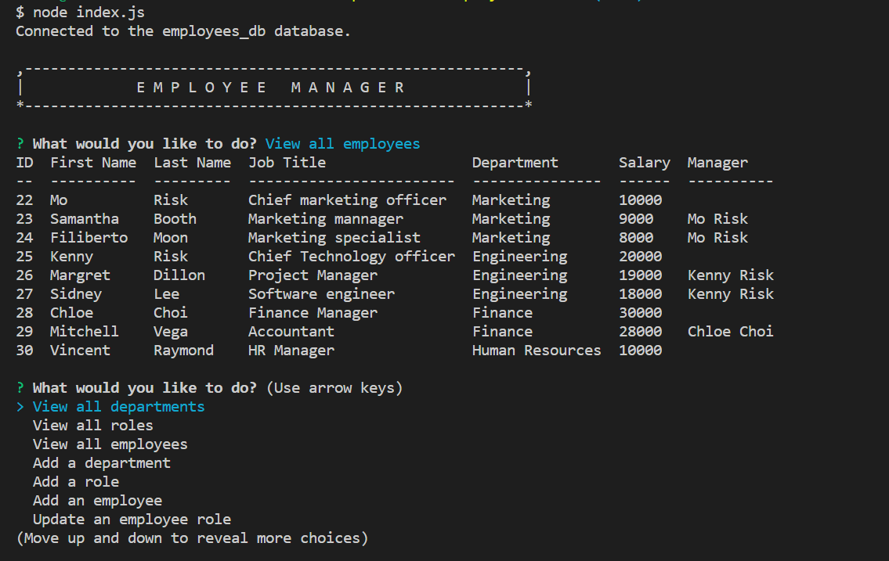

# employee-tracker

## Description
This is a command line application to manage a company's employee database using Node.js, inquirer, and MySQL.

## Table of Contents

- [Installation](#installation)
- [Usage](#usage)
- [Credit](#credit)
- [Questions](#questions)

## Installation
To use this application, you will only need Node.js and npm packages installed.   
On your desired folder to locate the app, pull down the Repo into your computer by following line on your terminal  

    $ git clone git@github.com:morisky78/employee-tracker.git

Go on [official Node.js website](https://nodejs.org/) and download the installer. 

Then install the npm package dependencies by following command

    $ npm install

Then, you will see node_modules folder has been created on your folder.

## Usage
When you run `node index.js`, the application will prompt you with a series of questions so that you will be able to view and manage the department, roles and employees in your company.

The following video shows an example usage of the app demonstrating the functionality.  
https://watch.screencastify.com/v/fcUlzyhEKjetaeDuxAaZ

The following options are available:
- View all departments
- View all roles
- View all employees
- Add a department
- Add a role
- Add an employee
- Update an employee role
- Update employee's manager
- View employees by manager
- View employees by department
- Delete a department
- Delete a role
- Delete an employee
- View the total utilized budget 

The following is the screenshot on the terminal showing all employees

## Credit
- npm console table
https://www.npmjs.com/package/console.table

- npm inquirer
https://www.npmjs.com/package/inquirer

- npm mysql2
https://www.npmjs.com/package/mysql2

## Questions

If you have any questions, please contact me moran.risk78@gmail.com  
GitHub  profile: [morisky78](https://github.com/morisky78)
